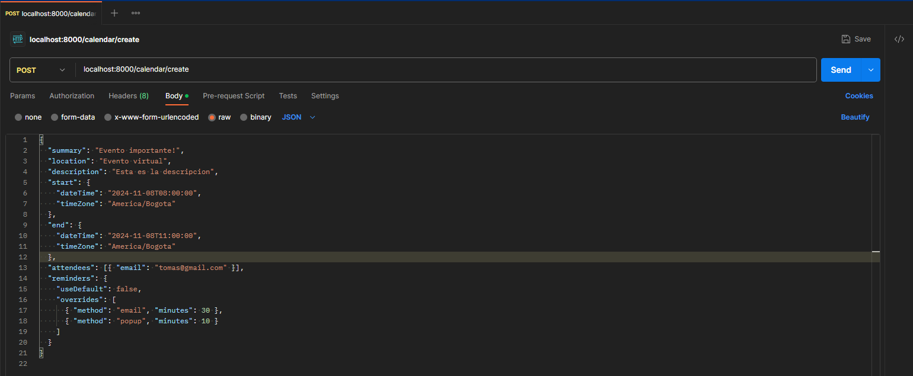
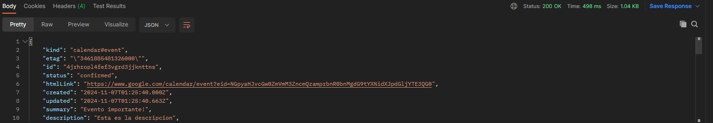
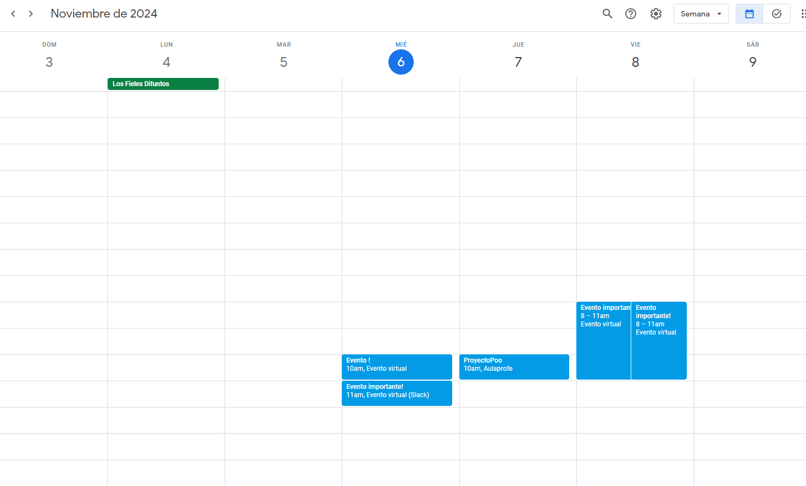

En esta parte del programa encontrarás la función para **_agregar, actualizar y eliminar_** tus actividades, ya sean:
- Grupos de estudio
- Preparación para exámenes
- Repaso de temas pendientes
- Hablar sobre tareas
- Etc

Primero deberás instalar todas las dependencias necesarias para que el API de Google Calendar funcione adecuadamente, ésto lo haces en el archivo de requirements.txt, allí te saltará una notificación que te pregunta si quieres instalar estas dependencias, le das que sí, y esperas.
Después de ésto, deberás abrir la aplicación de PostMan desde la cual podrás agregar, actualizar y eliminar tus eventos al calendario,
- Para agregar un evento, allí le das clic en la parte que dice "POST", y pondrás la siguiente ruta donde dice url: "localhost:8000/calendar/create" te vas a "body", luego seleccionas "raw", y al lado donde dice "Text", le das clic en "JSON", después de esto, te vas a este archivo, y te vas a la parte que dice "template.json", copias y pegas esa plantilla, la cual será tu base para crear tu evento;
allí podrás cambiar el titulo de tu reunión en donde dice "summary"; podrás cambiar la ubicación de esta, en donde dice "location"; podrás cambiar la descripción del evento, en la parte que "description". Luego para que puedas cambiar el horario de tu reunión, en la parte que dice "start", esa será la hora en la que iniciará tu reunión, y luego, abajo donde dice "end", esta será la hora en la que termina tu reunión.
Luego, en la parte de "attendees", será donde podrás agregar a tus invitados. Y por último, en la parte de overrides, será la parte donde podrás configurar, a los cuantos minutos restantes deseas que te notifique el calendario para que entres a tu reunión.
Y ya por último, le das clic arriba donde dice "send"

- Para actualizar un evento deberás guardar el id que te genera

Luego, en vez de darke clic en "POST", darás clic y lo cambiarás por "PUT", y ahora la ruta será esa: "localhost:8000/calendar/update/id", y donde dice id pondrás el id que se te generó anteriormente, y en el body cambiarás los datos que quieras, y por último le darás clic en "SEND", ahí ya se te actualizará el evento
- Para eliminar el evento, lo único que tendrás que hacer es pararte en donde habías puesto "PUT", y cambiarlo por "DELETE" y la ruta que pondrás será la siguiente: "localhost:8000/calendar/delete/id", pondrás el id del evento y le darás clic en "SEND" y allí se te eliminará el evento.
 Y ya por último puedes entrar a tú calendario de google y ver todas tus tareas, clases, reuniones, etc.!

